# reacjs_chai_with_code
0. [DOM](#dom-document-object-model-manipulation)
1. [VDOM](#vdom-virtual-dom-vdom)
2. [JSX](#jsx-javascript-xml)
2. [React JS Roadmap](#react-js-roadmap)
3. [Create react projects](#create-react-projects)
   - [React + React-DOM vs. React + React-Native](#react--react-dom-vs-react--react-native)
   - [npm and npx](#npm-and-npx)
   - [Creating a React Project](#creating-a-react-project)
     - [Using `create-react-app`](#using-create-react-app)
     - [Using `vite`](#using-vite)
   - [Understanding `package.json`](#understanding-packagejson)
     - [Project Information](#project-information)
     - [Dependencies](#dependencies)
     - [Scripts](#scripts)
     - [ESLint Configuration](#eslint-configuration)
     - [Supporting Browsers (Browserslist)](#supporting-browsers-browserslist)
4. [Understand the react flow and structure](#understand-the-react-flow-and-structure)
5. [Create your own react library and JSX](#create-your-own-react-library-and-jsx)
6. [Why you need hooks](#why-you-need-hooks)
    - [useState()](#usestate-hook) 
7. [Virtual DOM, Fibre and reconciliation](#virtual-dom-fibre-and-reconciliation)
    - [Explanation of Hydration in React](#explanation-of-hydration-in-react)
    - [Explanation of Reconciliation in React](#explanation-of-reconciliation-in-react) 
    - [Diffing Algorithm](#key-points-about-diff-algorithm)
    - [Explanation of React Fiber](#explanation-of-react-fiber)
    - [List Diffing with Keys in React Fiber](#list-diffing-with-keys-in-react-fiber)
8. [Props in ReactJs](#props-in-reactjs)
9. [A react interview question on counter](#a-react-interview-question-on-counter)
   - [Follow up Question on Counter](#follow-up-question-on-counter)
10. [onClick](#onclick-function) 
11. [useEffect, useRef and useCallback](#useeffect-useref-and-usecallback)
    - [useCallback](#usecallback)
    - [what if we use useEffect without useCallback](#what-if-do-not-use-call-back-and-directly-use-password-generator-function-to-call-through-useeffect)
    - [useEffect](#useeffect)
    - [useRef](#useref)

12. [Custom hooks in react and useId hook](#custom-hooks-in-react-and-useid-hook)
     - [useId hook](#useid-hook)
13. [React router crash course](#react-router-crash-course)
    - [<a>, <Link>, & <NavLink> Navigation Components in React](#navigation-components-in-react)
    - [Using NavLink in React Router](#using-navlink-in-react-router)
    - [Outlet in react router dom](#outlet-in-react-router-dom)
    - [Ways to representing routes](#way-to-representing-routes)
    - [useParmas from 'react-router-dom'](#use-useid-using-useparams)
    - [Github API fetching](#github-api-fetching)
    - [React Outlet again](#react-outlet)
    - [Concept of Loader](#concept-of-loader)
14. [Context API](#context-api)
15. [Todo List Application](#todo-list-application)
   - [Saving todos in Local Storage](#saving-todos-to-local-storage)

----


## DOM (Document Object Model) Manipulation

### Introduction

The DOM (Document Object Model) is a programming interface for web documents. It represents the structure of a document as a tree of objects, making it possible for programs to interact with the document's content, structure, and style.

### Key Points

1. **Tree Structure**: The DOM represents an HTML or XML document as a tree structure where each node is an object representing part of the document. These nodes can be elements, attributes, text, or other types of objects.

2. **Access and Manipulation**: Through the DOM, programs can access and modify the content, structure, and styles of documents. This is done using a variety of methods and properties provided by the DOM API. For example, you can change the text of an element, add or remove elements, or alter attributes.

3. **Event Handling**: The DOM allows you to listen for and respond to user interactions such as clicks, input, and other events. This is crucial for creating interactive web applications.

4. **Languages**: While the DOM can be used with various programming languages, it is most commonly used with JavaScript in the context of web browsers.

5. **Dynamic Updates**: The DOM provides the foundation for dynamic content updates in web pages, enabling rich user experiences without needing to reload the entire page.

### Example

Here is a simple example of how the DOM can be used with JavaScript to change the content of an HTML element:

```html
<!DOCTYPE html>
<html>
<head>
  <title>DOM Example</title>
</head>
<body>
  <p id="example">This is a paragraph.</p>
  <button onclick="changeContent()">Change Content</button>

  <script>
    function changeContent() {
      document.getElementById("example").innerText = "The content has been changed!";
    }
  </script>
</body>
</html>
```

In this example, when the button is clicked, the `changeContent` function is executed, which changes the text of the paragraph with the id "example". This demonstrates a simple DOM manipulation.

## DOM Manipulation Methods

### Accessing Elements

1. **`getElementById`**
   ```javascript
   document.getElementById("id");
   ```
2. **`getElementsByClassName`**
   ```javascript
   document.getElementsByClassName("class");
   ```
3. **`getElementsByTagName`**
   ```javascript
   document.getElementsByTagName("tag");
   ```
4. **`querySelector`**
   ```javascript
   document.querySelector("selector");
   ```
5. **`querySelectorAll`**
   ```javascript
   document.querySelectorAll("selector");
   ```

### Creating Elements

1. **`createElement`**
   ```javascript
   document.createElement("tag");
   ```

### Appending and Removing Elements

1. **`appendChild`**
   ```javascript
   parentNode.appendChild(newNode);
   ```
2. **`insertBefore`**
   ```javascript
   parentNode.insertBefore(newNode, referenceNode);
   ```
3. **`removeChild`**
   ```javascript
   parentNode.removeChild(childNode);
   ```
4. **`replaceChild`**
   ```javascript
   parentNode.replaceChild(newNode, oldNode);
   ```

### Modifying Element Content

1. **`innerHTML`**
   ```javascript
   element.innerHTML = "new content";
   ```
2. **`innerText` / `textContent`**
   ```javascript
   element.innerText = "new text";
   element.textContent = "new text";
   ```

### Modifying Attributes

1. **`getAttribute`**
   ```javascript
   element.getAttribute("attribute");
   ```
2. **`setAttribute`**
   ```javascript
   element.setAttribute("attribute", "value");
   ```
3. **`removeAttribute`**
   ```javascript
   element.removeAttribute("attribute");
   ```

### Modifying Classes

1. **`classList.add`**
   ```javascript
   element.classList.add("class");
   ```
2. **`classList.remove`**
   ```javascript
   element.classList.remove("class");
   ```
3. **`classList.toggle`**
   ```javascript
   element.classList.toggle("class");
   ```
4. **`classList.contains`**
   ```javascript
   element.classList.contains("class");
   ```

### Modifying Styles

1. **`style.property`**
   ```javascript
   element.style.property = "value";
   ```

### Event Handling

1. **`addEventListener`**
   ```javascript
   element.addEventListener("event", function);
   ```
2. **`removeEventListener`**
   ```javascript
   element.removeEventListener("event", function);
   ```

### Traversing the DOM

1. **`parentNode`**
   ```javascript
   element.parentNode;
   ```
2. **`childNodes`**
   ```javascript
   element.childNodes;
   ```
3. **`firstChild`**
   ```javascript
   element.firstChild;
   ```
4. **`lastChild`**
   ```javascript
   element.lastChild;
   ```
5. **`nextSibling`**
   ```javascript
   element.nextSibling;
   ```
6. **`previousSibling`**
   ```javascript
   element.previousSibling;
   ```
7. **`children`**
   ```javascript
   element.children;
   ```
8. **`firstElementChild`**
   ```javascript
   element.firstElementChild;
   ```
9. **`lastElementChild`**
   ```javascript
   element.lastElementChild;
   ```
10. **`nextElementSibling`**
   ```javascript
   element.nextElementSibling;
   ```
11. **`previousElementSibling`**
   ```javascript
   element.previousElementSibling;
   ```

### Working with Forms

1. **`form.elements`**
   ```javascript
   form.elements;
   ```
2. **`form.submit`**
   ```javascript
   form.submit();
   ```
3. **`form.reset`**
   ```javascript
   form.reset();
   ```

### Node Manipulation

1. **`cloneNode`**
   ```javascript
   node.cloneNode(true/false); // true for deep clone
   ```
2. **`normalize`**
   ```javascript
   element.normalize();
   ```

These methods cover a wide range of operations you can perform on the DOM to dynamically create, modify, and interact with the web document.

---
## VDOM [Virtual DOM (VDOM)]
The Virtual DOM (VDOM) is a concept implemented in libraries like React to optimize the process of updating the DOM. Here's how it works and how it efficiently updates the actual DOM:

### 1. Initial Rendering
When you first render a React component, the following happens:
- **Component Rendering**: React creates a Virtual DOM tree that represents the structure of the UI based on the component's render method.
- **DOM Rendering**: React then converts this Virtual DOM tree into the actual DOM and injects it into the browser.

### 2. State or Props Changes
When the state or props of a component change, React performs the following steps:

1. **Re-render the Component**:
   - React re-renders the component to produce a new Virtual DOM tree that reflects the updated state or props.

2. **Diffing Algorithm**:
   - React uses a diffing algorithm to compare the new Virtual DOM tree with the previous one. This algorithm identifies what has changed.

3. **Create a Patch**:
   - Based on the differences found, React creates a "patch" that describes the minimum set of changes needed to update the real DOM.

4. **Update the Real DOM**:
   - React applies this patch to the actual DOM. This might involve changing text content, updating attributes, or adding/removing elements. By only applying the minimal set of changes, React ensures the DOM updates are efficient.

### Example Process

1. **Initial Render**:
   ```javascript
   const root = ReactDOM.createRoot(document.getElementById('root'));
   root.render(<App />);
   ```

2. **State Update**:
   ```javascript
   function App() {
     const [count, setCount] = React.useState(0);

     return (
       <div>
         <p>{count}</p>
         <button onClick={() => setCount(count + 1)}>Increment</button>
       </div>
     );
   }
   ```

3. **Diffing and Patching**:
   - When `setCount` is called, React re-renders `App` and creates a new Virtual DOM tree.
   - React compares the new Virtual DOM tree to the previous one.
   - React determines that only the text content of the `<p>` tag has changed.
   - React updates only the text content in the actual DOM, leaving the rest of the DOM untouched.

### Advantages of the Virtual DOM

1. **Performance**: By minimizing direct DOM manipulations, React avoids the performance cost of frequent, large-scale updates.
2. **Predictability**: The diffing algorithm ensures that only the necessary updates are made, leading to fewer bugs and more predictable performance.
3. **Declarative UI**: Developers write code that describes what the UI should look like in various states, and React takes care of the efficient updates.

### Conclusion
The Virtual DOM abstracts the complexity of direct DOM manipulation by using a lightweight representation of the DOM and an efficient diffing algorithm. This approach ensures that updates to the UI are performed in the most optimal way, leading to better performance and a smoother user experience.

---
## JSX [JavaScript XML]
JSX (JavaScript XML) is a syntax extension for JavaScript, commonly used with React, which allows you to write HTML-like code within JavaScript. This makes it easier to create and visualize the structure of your UI components. JSX is not mandatory for using React, but it is highly recommended because of its readability and ease of use.

### Key Features of JSX

1. **HTML-Like Syntax**:
   - JSX allows you to write elements that look similar to HTML. For example:
   ```jsx
   const element = <h1>Hello, world!</h1>;
   ```

2. **Embedding Expressions**:
   - You can embed any JavaScript expression within JSX by wrapping it in curly braces `{}`.
   ```jsx
   const name = "John";
   const element = <h1>Hello, {name}!</h1>;
   ```

3. **Attributes**:
   - JSX attributes are similar to HTML attributes, but they follow the camelCase convention for naming.
   ```jsx
   const element = <div className="myClass" tabIndex={0}></div>;
   ```

4. **Children**:
   - Elements can have children, which can be other elements or plain text.
   ```jsx
   const element = (
     <div>
       <h1>Hello, world!</h1>
       <p>This is a paragraph.</p>
     </div>
   );
   ```

### How JSX Works

JSX is syntactic sugar for `React.createElement()` method calls. When JSX code is compiled (using tools like Babel), it transforms into regular JavaScript function calls that create React elements.

For example:
```jsx
const element = <h1>Hello, world!</h1>;
```
is transformed into:
```javascript
const element = React.createElement('h1', null, 'Hello, world!');
```

And a more complex example:
```jsx
const element = (
  <div>
    <h1>Hello, world!</h1>
    <p>This is a paragraph.</p>
  </div>
);
```
is transformed into:
```javascript
const element = React.createElement(
  'div',
  null,
  React.createElement('h1', null, 'Hello, world!'),
  React.createElement('p', null, 'This is a paragraph.')
);
```

### Benefits of Using JSX

1. **Readability**: JSX syntax closely resembles HTML, making it easier to read and understand the structure of the UI.
2. **Expressiveness**: Embedding JavaScript expressions within JSX allows for more dynamic and expressive UI code.
3. **Component Structure**: JSX naturally encourages the creation of reusable components, which is a core concept in React.

### Example Usage

Here’s a simple React component written using JSX:

```jsx
import React from 'react';

function Greeting(props) {
  return <h1>Hello, {props.name}!</h1>;
}

function App() {
  return (
    <div>
      <Greeting name="Alice" />
      <Greeting name="Bob" />
    </div>
  );
}

export default App;
```

In this example:
- `Greeting` is a functional component that takes `props` as an argument and returns a JSX element.
- `App` is another functional component that uses `Greeting` twice with different `name` props.

### Conclusion

JSX is a powerful feature of React that allows you to write HTML-like syntax directly in your JavaScript code. It improves readability and expressiveness, making it easier to build complex UIs. By understanding how JSX is transformed into JavaScript, you can better appreciate its role in React development and leverage it to create efficient and maintainable components.
---
## React JS Roadmap

### Why Learn React?

- **Trending and Widely Used**: React is a popular choice for building user interfaces.
- **Managing Complex Frontends**: While UI can be built with jQuery and CSS libraries, React simplifies the management and construction of complex frontends.
    - **Complex Frontends**: React efficiently handles state changes, ensuring that updates in one part of the application reflect seamlessly across the entire UI.

### When Should I Learn React?

- **Project Phases**: Most projects don't need React in the initial phase.
- **Simple Tasks**: Simple tasks like fetching data from an API and displaying it in a card do not require React.

### Why Was React Created?

- **Phantom Message Problem on Facebook**
- **State Management**: JavaScript manages the state (like variables), while the Document Object Model (DOM) manages the UI.
  

  

  - **State and UI Synchronization**: The state, such as the message count, is stored in a variable and displayed in the UI. Before React, state and DOM were not synchronized, causing state changes to not reflect directly in the UI without a refresh.

- **Early Adopters**: Khan Academy and Unsplash were among the first to use React in their projects.

### React Learning Process

1. **Go In-Depth**:
   - Learn Babel
   - Learn Fiber
   - Learn Virtual DOM
   - Learn Diffing Algorithm
   - Learn Hydration

2. **By Making Projects**:
   - Apply the in-depth topics by building projects.

### React is a Library!

- [Framework vs. Library](https://www.programmingcube.com/framework-vs-library/)

- **Frameworks**: Follow certain rules, e.g., Django.
- **Libraries**: Offer freedom and flexibility, e.g., React.

### Topics to Learn

- **Core Concepts**: State and UI Manipulation, JSX (HTML embedded in JavaScript).
- **Component Reusability**: Use props to reuse components like cards, footers, headers, etc., in different places.
- **Propagating Changes**: Learn about hooks for managing state and effects.

### Additional Add-ons for React

*React enables single-page applications without reloading. To manage URLs, use `react-router`.*

- **Router**: React does not have a built-in router.
  - Install `react-router-dom` to use routing in React projects.
- **State Management**: React does not include built-in state management.
    - Use libraries like `Redux`, `Redux Toolkit` (an abstraction of Redux), Zustand, or `Context API` (all JavaScript libraries).
- **Class-Based Components**: Used in legacy code; modern React uses functional components.
- **BAAS Apps (Backend as a Service)**:
    - Utilize services like Firebase or Supabase to avoid writing backend from scratch.
    - Create social media clones, e-commerce apps, etc., using BAAS.

### After Learning React

- **Limitations**: React does not have built-in SEO capabilities, JavaScript rendering on the server, or default routing.
- **Frameworks**:
  - **Next.js**: Integrates backend and frontend within a single page.
  - **Gatsby**
  - **Remix**
----

## Create react projects

### React + React-DOM vs. React + React-Native

- **React + React-DOM**: Used for building web applications.
- **React + React-Native**: Used for building mobile applications.

### npm and npx

- **npm (Node Package Manager)**: Used for managing packages.
- **npx (Node Package Executer)**: Used for running Node packages without globally installing them.

### Creating a React Project

1. **Using `create-react-app`**

    ```sh
    npx create-react-app project01
    ```
    
    - `create-react-app` is a utility for creating new React projects.
    - **Commands**:
        - `npm run start`: Runs the project in development mode.
        - `npm run build`: Builds the project for production, creating an additional `build` folder.
    - **Note**: 
        - `create-react-app` is a bulky utility and not the fastest way to create a React app.
        - It is not recommended for larger projects.

   
    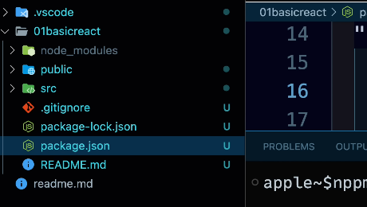
   
2. **Using `vite`**

    ```sh
    npm create vite@latest
    ```
    
    - `vite` is a faster bundler for creating React apps.
    - **Commands**:
        - `npm run dev`: Starts the project in development mode.

### Understanding `package.json`

```json
{
  "name": "01basicreact",
  "version": "0.1.0",
  "private": true,
  "dependencies": {
    "@testing-library/jest-dom": "^5.17.0",
    "@testing-library/react": "^13.4.0",
    "@testing-library/user-event": "^13.5.0",
    "react": "^18.2.0",
    "react-dom": "^18.2.0",
    "react-scripts": "5.0.1",
    "web-vitals": "^2.1.4"
  },
  "scripts": {
    "start": "react-scripts start",
    "build": "react-scripts build",
    "test": "react-scripts test",
    "eject": "react-scripts eject"
  },
  "eslintConfig": {
    "extends": [
      "react-app",
      "react-app/jest"
    ]
  },
  "browserslist": {
    "production": [
      ">0.2%",
      "not dead",
      "not op_mini all"
    ],
    "development": [
      "last 1 chrome version",
      "last 1 firefox version",
      "last 1 safari version"
    ]
  }
}
```

- **Project Information**:
    ```json
    "name": "01basicreact",  // Project name
    "version": "0.1.0",      // Project version
    ```

- **Dependencies**:
    - **Testing Libraries**:
        ```json
        "@testing-library/jest-dom": "^5.17.0",
        "@testing-library/react": "^13.4.0",
        "@testing-library/user-event": "^13.5.0",
        ```
    - **Web Vitals**:
        ```json
        "web-vitals": "^2.1.4"
        ```
        - Used to track the performance of your application.

- **Scripts**:
    ```json
    "scripts": {
      "start": "react-scripts start",
      "build": "react-scripts build",
      "test": "react-scripts test",
      "eject": "react-scripts eject"
    }
    ```
    - `start`: Runs the project in a development environment.
    - `build`: Builds the project for production.
    - `test`: Runs test cases.
    - `eject`: Allows you to customize the project configuration.

- **ESLint Configuration**:
    ```json
    "eslintConfig": {
      "extends": [
        "react-app",
        "react-app/jest"
      ]
    }
    ```
    - ESLint helps maintain coding standards and minimize errors. This is particularly important for JavaScript, which is prone to developer errors due to its dynamic and loosely-typed nature.

### Supporting Browsers (Browserslist)

```json
"browserslist": {
  "production": [
    ">0.2%",
    "not dead",
    "not op_mini all"
  ],
  "development": [
    "last 1 chrome version",
    "last 1 firefox version",
    "last 1 safari version"
  ]
}
```
- Specifies the browsers supported by your project in both production and development environments.

----
Certainly! Here is an improved version of the document:

---

## Understanding React Flow and Structure

### Single Page Application (SPA)

- **React is a Single Page Application (SPA)** framework, which means it dynamically updates the content of a single HTML page.
- All components are mounted within a single page (`index.html`).

  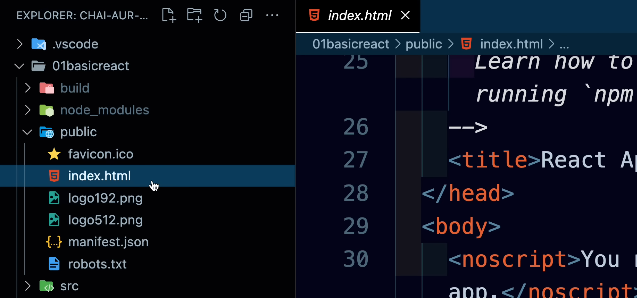

- **Fallback for JavaScript Disabled**:
  ```html
  <noscript>You need to enable JavaScript to run this app.</noscript>
  ```
  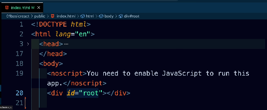
  - This message is shown if JavaScript is not enabled in the web browser.

### React Virtual DOM


- **ReactDOM**:
  - A package in the React library that provides methods to interact with the DOM.
  - Used to render React components and manage their lifecycle in the browser.
  - Bridges the gap between React's virtual DOM and the browser's actual DOM.

### Enhancing HTML with JavaScript

- **Rendering Components**:
  - In React, components like `<App/>` are rendered, enhancing HTML's capabilities.

  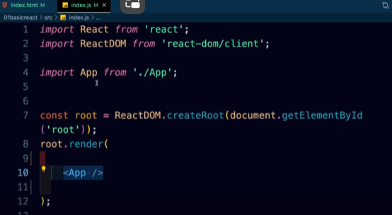

- **Component as Functions**:
  - `<App/>` is a JavaScript function returning HTML-like syntax (JSX).

  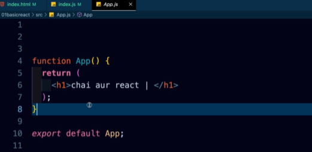

---

### Conclusion

React's architecture leverages the power of the virtual DOM and JavaScript to create efficient, dynamic, and maintainable web applications within a single page structure. Understanding the flow and structure of React helps in building robust and performant applications.

### Client Side Routing
In a React application, the URL can change without reloading the page by using React Router, a library for handling client-side routing. This allows for smooth transitions between different views in your app without full page reloads. 

### Key Components:

1. **Router**: Wraps the application. Commonly used `BrowserRouter` for most apps.
   ```jsx
   import { BrowserRouter as Router } from 'react-router-dom';
   ```

2. **Route**: Defines the relationship between a URL path and a component.
   ```jsx
   import { Route } from 'react-router-dom';

   <Route path="/about" component={About} />;
   ```

3. **Link**: Provides navigation without a page reload.
   ```jsx
   import { Link } from 'react-router-dom';

   <Link to="/about">About</Link>;
   ```

4. **Switch**: Renders the first matching `Route`.
   ```jsx
   import { Switch, Route } from 'react-router-dom';

   <Switch>
     <Route path="/about" component={About} />
     <Route path="/contact" component={Contact} />
   </Switch>;
   ```

### Example Usage:

```jsx
import React from 'react';
import { BrowserRouter as Router, Route, Switch, Link } from 'react-router-dom';

function Home() { return <h1>Home Page</h1>; }
function About() { return <h1>About Page</h1>; }
function Contact() { return <h1>Contact Page</h1>; }

function App() {
  return (
    <Router>
      <nav>
        <Link to="/">Home</Link>
        <Link to="/about">About</Link>
        <Link to="/contact">Contact</Link>
      </nav>
      <Switch>
        <Route path="/" exact component={Home} />
        <Route path="/about" component={About} />
        <Route path="/contact" component={Contact} />
      </Switch>
    </Router>
  );
}

export default App;
```

### Summary

- **React Router**: Allows URL changes without page reloads, enabling smooth navigation.
- **Components**: Use `Router`, `Route`, `Link`, and `Switch` to define navigation and routing.
- **Benefit**: Provides a seamless, single-page application experience.

---

## Create your own react library and JSX

- `<MyApp />` : it is JSX function call
- `MyApp()`   : it is also function call both will behave same

  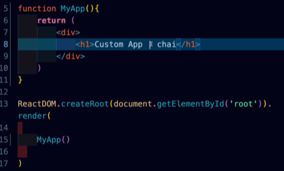

  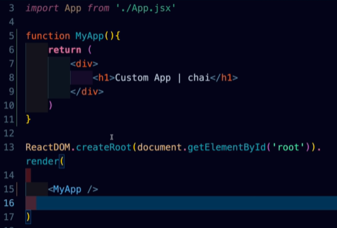


In React, JavaScript can indeed be written within the `return` statement, but it needs to be enclosed in curly braces `{}` to differentiate JavaScript expressions from JSX syntax. JSX (JavaScript XML) is a syntax extension that allows you to write HTML-like code within JavaScript, used extensively in React for defining UI components.

### Reasons for Using Curly Braces `{}` in JSX:

1. **Embedding JavaScript Expressions**: JSX allows embedding JavaScript expressions within curly braces `{}` directly in the markup.
   
   ```jsx
   function Greeting(props) {
     const name = props.name;
     return <h1>Hello, {name}!</h1>;
   }
   ```

2. **Dynamic Content**: Curly braces `{}` are used to inject dynamic content, such as variables, function calls, or calculations, into JSX elements.

   ```jsx
   function Button(props) {
     const buttonText = props.isActive ? 'Active' : 'Inactive';
     return <button>{buttonText}</button>;
   }
   ```

3. **JavaScript Logic**: While you can write basic JavaScript expressions directly in JSX, complex logic or multiple statements are typically handled outside the `return` statement for clarity and maintainability.

   ```jsx
   function ExampleComponent(props) {
     const isLoggedIn = props.isLoggedIn;
     
     // JavaScript logic outside return
     if (isLoggedIn) {
       return <UserDashboard />;
     } else {
       return <LoginForm />;
     }
   }
   ```

### Why Not JavaScript Directly in JSX?

- **JSX vs. JavaScript Separation**: JSX is designed to resemble HTML, making the code more readable and maintainable for UI components. Mixing complex JavaScript logic directly within JSX can make the code harder to understand.

- **Component Rendering**: JSX should primarily focus on describing the UI structure based on state and props. Keeping JavaScript logic outside `return` helps in maintaining a clear separation of concerns and improves code organization.

- **Rendering Efficiency**: React optimizes JSX rendering by efficiently diffing the virtual DOM. Complex JavaScript logic directly within JSX may hinder React's ability to optimize updates effectively.

### Best Practices:

- **Use Curly Braces for Expressions**: Embrace JSX's ability to embed JavaScript expressions within `{}` for dynamic content.
  
- **Separate Logic from JSX**: Keep complex JavaScript logic, conditionals, and loops outside the `return` statement to enhance readability and maintainability.

- **Functional Components**: With the introduction of React Hooks, functional components are preferred, where JavaScript logic can be encapsulated in custom hooks or functional components, promoting reusability and testability.

In essence, while React allows embedding JavaScript expressions within JSX using curly braces `{}`, it's crucial to maintain a balance between JSX's declarative nature and JavaScript's imperative logic for building efficient and maintainable UI components.


Refer video.

---

## Why you need hooks

### UI Updations

- Here JavaScript does own work of increasing or decreasing the value of counter vairable but not could not able to update the UI.

- To udpate UI you we use DOM manipulation selceting id then chnage the value but what about React?

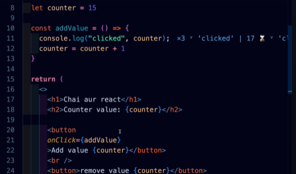

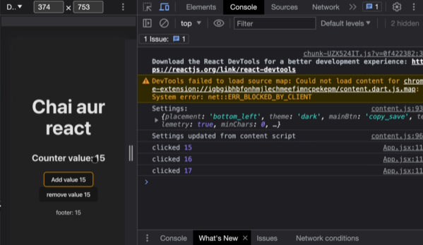

- To tackle above problem we need to use Hook.
- To tackle problem of changing state of variable into UI we need a specific hook know as `useState`

### `useState` Hook and Types of Initial State

### Why const used 
Using const with useState in React functional components ensures that state variables maintain a consistent reference, preventing accidental reassignments and promoting a clear and predictable state management pattern. This approach aligns with React's principles of declarative and predictable state handling in functional components.


### `useState` Hook

The `useState` hook in React allows functional components to manage local state.

#### Syntax

```javascript
const [state, setState] = useState(initialState);
```

- **`state`**: Current state value. Holds the latest value of the state.
- **`setState`**: Function used to update the state. Schedules a re-render with the new state value.
- **`initialState`**: Initial value for the state. Can be a primitive type, object, array, or a function returning an initial value.

### Types of Initial State

1. **Primitive Types**

   - **Number**:
     ```javascript
     const [count, setCount] = useState(0); // Number initial state
     ```

   - **String**:
     ```javascript
     const [name, setName] = useState(''); // String initial state
     ```

   - **Boolean**:
     ```javascript
     const [isActive, setIsActive] = useState(false); // Boolean initial state
     ```

2. **Complex Types**

   - **Object**:
     ```javascript
     const [user, setUser] = useState({ name: 'John', age: 30 }); // Object initial state
     ```

   - **Array**:
     ```javascript
     const [list, setList] = useState(['apple', 'banana', 'cherry']); // Array initial state
     ```

3. **Function**

   - Lazy Initialization:
     ```javascript
     const [count, setCount] = useState(() => {
       return someExpensiveComputation();
     });
     ```

### Example Usage with `setCount`

#### Example: Counter Component

```javascript
import React, { useState } from 'react';

function Counter() {
  // Define a state variable 'count' with initial value 0
  const [count, setCount] = useState(0);

  return (
    <div>
      <p>Count: {count}</p>
      <button onClick={() => setCount(count + 1)}>Increment</button>
    </div>
  );
}
```

In this example:

- `count` is a state variable initialized with `useState(0)`.
- `setCount` is used to update `count` when the button is clicked, incrementing the count by 1.

### Usage Tips

- **Immutable Updates**: Always update state immutably (especially for objects and arrays) to ensure React detects changes correctly.

- **Lazy Initialization**: Use a function for initial state when initialization involves complex computations or needs to be lazy-loaded.

### Conclusion

Understanding the `useState` hook and the types of initial state it supports is fundamental for managing state in React functional components. By choosing the appropriate initial state type and using `setState` effectively, you can manage component state and ensure optimal rendering and performance.

---

## Virtual DOM, Fibre and reconciliation


### Explanation of Hydration in React

1. **Server-side Rendering (SSR)**:
   - When you visit a website built with React, the server generates the initial HTML content and sends it to your browser.

   ```html
   <!-- Server sends this HTML to your browser -->
   <div id="root">
     <h1>Hello World</h1>
     <p>This content is generated on the server.</p>
   </div>
   ```

2. **Client-side Hydration**:
   - Once your browser receives this HTML, React takes over and "hydrates" it. This means React attaches event listeners and makes the page interactive.

   ```javascript
   // React takes over and makes the page interactive
   import React from 'react';
   import ReactDOM from 'react-dom';
   import App from './App';

   // Hydrate the server-rendered HTML at the 'root' element
   ReactDOM.hydrate(<App />, document.getElementById('root'));
   ```

3. **Enhanced Interactivity**:
   - React turns static HTML into a dynamic application. It adds buttons, forms, and other interactive elements that respond to your clicks and input.

   ```jsx
   // React Component example
   import React from 'react';

   function App() {
     return (
       <div>
         <h1>Hello World</h1>
         <p>This content is made interactive by React.</p>
         <button onClick={() => alert('Button clicked!')}>Click Me</button>
       </div>
     );
   }

   export default App;
   ```

4. **Benefits**:
   - **Faster Loading**: You see content quickly because the server sends HTML first, and React makes it interactive afterward.
   - **SEO Friendly**: Search engines can read the initial HTML, improving search engine visibility.
   - **Accessibility**: Content is accessible even without JavaScript, ensuring everyone can use the site.

### Simple Summary:

Hydration in React is about making server-generated HTML interactive. React starts with a static page from the server and turns it into a dynamic web app that responds to your actions, providing a smooth and fast user experience.

---
### Explanation of Reconciliation in React

1. **Virtual DOM (VDOM)**:
   - React keeps a virtual representation of the actual DOM called Virtual DOM. It's like a blueprint of how your UI should look.

2. **Updating the UI**:
   - When something changes (like state or props), React compares the new Virtual DOM with the previous one to see what's different.

3. **Efficient Updates**:
   - React figures out the smallest number of changes needed to update the real DOM. It doesn’t redraw everything, just what's necessary.

4. **Component Lifecycle**:
   - React components have lifecycle methods (`componentDidUpdate`, `componentWillUpdate`) that help them prepare for updates and respond after updates are applied.

5. **Example Scenario**:
   - Imagine a counter app. When you click a button to increment the count, React only updates the number displayed on the screen, not the entire page.

#### Simple Benefits:

- **Faster Performance**: React updates only what’s needed, making your app faster and more responsive.
- **Accurate UI**: Ensures that the UI always reflects the latest changes in state or props.
- **Easier Development**: Developers can focus on writing code without worrying about manual DOM updates.

#### Summary:

Reconciliation in React is about efficiently updating your app’s UI. It uses Virtual DOM to quickly compare changes and update only what’s necessary in the real DOM, ensuring a smooth and efficient user experience.

### Key Points about Diff Algorithm:

The **diffing algorithm** in the context of React refers to the process of comparing two versions of the Virtual DOM (before and after a state or prop change) to identify what changes need to be applied to the real DOM. This algorithm is crucial for React's efficient rendering and updating mechanism. Here’s a simplified explanation:


1. **Virtual DOM Representation**:
   - React maintains a virtual representation of the actual DOM known as the Virtual DOM. This virtual representation reflects the current state of the UI.

2. **Identifying Changes**:
   - When state or props change in a React component, React generates a new Virtual DOM representation.
   - The diffing algorithm then compares this new Virtual DOM with the previous one to determine what has changed.

3. **Minimal Updates**:
   - The algorithm aims to find the minimal set of differences (or "diffs") between the old and new Virtual DOM trees.
   - Instead of re-rendering the entire component, React applies only these necessary changes to update the real DOM efficiently.

4. **Key Strategies**:
   - **Tree Diffing**: React performs a top-down, depth-first traversal of both Virtual DOM trees to compare nodes and their attributes.
   - **Keys in Lists**: React uses keys on elements in lists to optimize reordering and minimize DOM manipulations.

5. **Efficiency and Performance**:
   - By minimizing DOM updates to only what’s necessary, React improves the performance and responsiveness of the application.
   - Efficient diffing ensures that updates are fast, even for complex UI components with nested structures.

#### Example Scenario:

```jsx
// Example React Component
import React, { useState } from 'react';

function Counter() {
  const [count, setCount] = useState(0);

  const increment = () => {
    setCount(count + 1); // State update triggers diffing algorithm
  };

  return (
    <div>
      <p>Count: {count}</p>
      <button onClick={increment}>Increment</button>
    </div>
  );
}
```

- When `setCount` updates the `count` state, React uses the diffing algorithm to compare the old and new Virtual DOM trees.
- It identifies that only the `{count}` part of the DOM needs updating, not the entire component.

#### Benefits of Diff Algorithm:

- **Improved Performance**: Reduces unnecessary DOM manipulations, making the application faster.
- **Accurate Updates**: Ensures that the UI reflects the latest changes in state or props accurately.
- **Developer Productivity**: Allows developers to focus on writing declarative React code without manually optimizing DOM updates.

#### Summary:

The diff algorithm in React is fundamental for efficiently updating the UI. By comparing Virtual DOM representations and applying minimal changes to the real DOM, React ensures optimal performance and a responsive user interface.


### Explanation of React Fiber

React Fiber is an upgrade to how React works behind the scenes. It makes React apps faster and more responsive, especially for big and complex applications.

- **Purpose**: 
  - React Fiber improves how React handles updates to your app’s user interface (UI). It focuses on making things smoother and faster.

- **How It Works**: 
  - It breaks down tasks into smaller parts called "fibers". This helps React prioritize which updates to work on first, making your app feel more snappy.

- **Benefits**: 
  - **Faster Rendering**: React Fiber speeds up how quickly your app shows changes on the screen.
  - **Better for Big Apps**: It’s designed to handle large and complex apps more efficiently.
  - **Supports New Features**: Sets the stage for future improvements like smoother animations and handling multiple tasks at once.

- **Usage**: 
  - As a developer, you benefit from React Fiber’s improvements without needing to change how you write your React components. It’s all about making React apps faster and more reliable.

#### Example:

Imagine you have a shopping app with lots of products. React Fiber helps the app update prices and show new products quickly, even if the user is scrolling or adding items to their cart.

#### Conclusion:

React Fiber is like a performance upgrade for React. It makes your apps run smoother and respond faster, especially useful for apps with lots of data or interactive features.

---

In React, especially with the introduction of React Fiber, **keys** play a crucial role in efficiently rendering and updating lists of elements. Let's delve into how keys are used in the context of React Fiber for performing list diffing:

### List Diffing with Keys in React Fiber

1. **Key Attribute**:
   - In React, the `key` attribute is a special attribute that needs to be assigned to elements inside arrays or iterated lists of components.

   ```jsx
   // Example usage of key in a list of components
   const items = [
     { id: 1, text: 'Item 1' },
     { id: 2, text: 'Item 2' },
     { id: 3, text: 'Item 3' },
   ];

   function ListComponent() {
     return (
       <ul>
         {items.map(item => (
           <li key={item.id}>{item.text}</li>
         ))}
       </ul>
     );
   }
   ```

2. **Purpose of Keys**:
   - **Uniqueness**: Keys help React identify which items have changed, are added, or are removed. Each key must be unique among siblings in the same list.
   - **Optimization**: React uses keys during the reconciliation process to determine the minimal set of changes needed to update the list efficiently.

3. **Role in Diffing**:
   - When the list changes (e.g., items are added, removed, or reordered), React's diffing algorithm compares the old list with the new list using keys.
   - React matches elements by their keys to identify changes. Elements with the same key are assumed to be the same component instance, enabling efficient updates without unnecessary re-rendering.

4. **Key Guidelines**:
   - **Stable Identifiers**: Keys should be stable and not change between renders unless the identity of the item itself changes.
   - **Avoid Indexes**: Using indexes (`key={index}`) as keys can lead to performance issues and incorrect behavior, especially when items are reordered or removed.

5. **Benefits**:
   - **Performance**: Using keys effectively ensures that React can update lists efficiently, even when dealing with complex nested structures or frequent updates.
   - **Correctness**: Helps React maintain the correct component state and avoid re-rendering unnecessary components when lists change.

#### Example Scenario in React Fiber

```jsx
import React, { useState } from 'react';

function TodoList({ todos }) {
  return (
    <ul>
      {todos.map(todo => (
        <li key={todo.id}>
          {todo.text}
        </li>
      ))}
    </ul>
  );
}

function App() {
  const [todos, setTodos] = useState([
    { id: 1, text: 'Learn React' },
    { id: 2, text: 'Build an App' },
    { id: 3, text: 'Deploy to Production' },
  ]);

  const addTodo = () => {
    const newTodo = {
      id: todos.length + 1,
      text: `New Todo ${todos.length + 1}`,
    };
    setTodos([...todos, newTodo]);
  };

  return (
    <div>
      <button onClick={addTodo}>Add Todo</button>
      <TodoList todos={todos} />
    </div>
  );
}

export default App;
```

- In this example, each todo item in the list has a unique `id` used as a `key`.
- When `addTodo` is called, React efficiently updates the list by appending the new todo item, maintaining the correct order and minimizing unnecessary re-renders.

#### Conclusion

Keys are essential for React's diffing algorithm, especially in React Fiber, as they enable efficient list updates by uniquely identifying elements and optimizing the reconciliation process. Proper usage of keys ensures React can update lists smoothly and maintain optimal performance in complex UI scenarios.

## Props in reactjs

Props (short for properties) in React are used to pass data from one component to another. They serve several key purposes in React applications:

### Reasons to Use Props in React:

1. **Component Communication**:
   - Props allow parent components to pass data down to child components. This makes it easy to compose complex UIs from simpler components.

2. **Data Flow**:
   - Props enable uni-directional data flow in React, ensuring that data flows from parent to child components. This helps maintain a clear and predictable data flow pattern.

3. **Dynamic UIs**:
   - Props make it possible to create dynamic and reusable components. By passing different props, components can render different data or behave differently based on their input.

4. **Configuration**:
   - Props are used to configure components with specific data or behavior. For example, a `<Button>` component might receive props for its label, color, and onClick handler.

5. **Component Composition**:
   - Props facilitate component composition, allowing developers to build UIs by combining small, reusable components that each have specific responsibilities and inputs.

### Example Scenario:

```jsx
// Example of using props in a React component
import React from 'react';

// Parent Component
function App() {
  const greeting = "Hello, React!";
  return (
    <div>
      {/* Passing `greeting` as a prop to ChildComponent */}
      <ChildComponent message={greeting} />
    </div>
  );
}

// Child Component
function ChildComponent(props) {
  return (
    <div>
      <p>{props.message}</p>
    </div>
  );
}

export default App;
```

- In this example, the `message` prop is passed from the `App` component to the `ChildComponent`, allowing the child to display the greeting dynamically.

### Benefits of Using Props:

- **Reusability**: Components can be reused across different parts of the application with different data inputs.
- **Maintainability**: Encourages separation of concerns by keeping data and UI logic isolated within components.
- **Flexibility**: Enables components to be customizable and adaptable to various use cases without modifying their core implementation.

### Conclusion:

Props are fundamental in React for passing data and configuring components, enabling developers to create flexible and reusable UI components that can be composed together to build complex applications. They promote a modular and maintainable approach to building user interfaces in React.


### Using ES6 Default Values

```jsx
import React from 'react';

function Greeting({ name = 'Guest' }) {
  return <p>Hello, {name}!</p>;
}

export default Greeting;
```

In this example:
- The `Greeting` component accepts a `name` prop, and if the prop is not provided or is `undefined`, it defaults to `'Guest'`.

### Benefits:
- Simplifies component code by setting default values directly in the parameter list.
- Provides a clear and concise way to handle missing or undefined props.

Using default parameter values in function parameters is a straightforward approach to ensuring your components have default values when specific props are not passed to them.

---

## A react interview question on counter 

### Interview Question: React Counter Component

**Question:**
Create a React component called `Counter` that displays a count starting from 0. The component should include buttons for incrementing and decrementing the count by 1, and it should also include a button to reset the count to 0. Ensure that the count cannot go below 0.

**Requirements:**
- Display the current count.
- Buttons for incrementing, decrementing, and resetting the count.
- Ensure the count does not go below 0 when decrementing.

**Bonus:**
- Style the counter to make it visually appealing.
- Add functionality to allow incrementing or decrementing by a value other than 1 (e.g., increment by 5).

**Example Implementation:**

```jsx
import React, { useState } from 'react';

const Counter = () => {
  const [count, setCount] = useState(0);

  const increment = () => {
    setCount(count + 1);
  };

  const decrement = () => {
    if (count > 0) {
      setCount(count - 1);
    }
  };

  const reset = () => {
    setCount(0);
  };

  return (
    <div className="counter">
      <h2>Counter: {count}</h2>
      <div className="button-container">
        <button onClick={increment}>Increment</button>
        <button onClick={decrement}>Decrement</button>
        <button onClick={reset}>Reset</button>
      </div>
    </div>
  );
};

export default Counter;
```

### Explanation:
- **useState**: Manages the state of `count` starting from 0.
- **increment**: Increases `count` by 1 when the "Increment" button is clicked.
- **decrement**: Decreases `count` by 1 when the "Decrement" button is clicked, but only if `count` is greater than 0.
- **reset**: Resets `count` to 0 when the "Reset" button is clicked.
- **CSS**: You can add CSS to style the `Counter` component and its buttons for better visual presentation.

This question tests your understanding of state management (`useState`), event handling in React, conditional rendering, and basic UI interaction. It also allows for additional complexity if the interviewer requests bonus features like styling or custom increment/decrement values.

### Follow up Question on Counter
 
In React, when you call `setCount` to update the state based on the current state (`count` in this case), it does not immediately update `count` synchronously. Instead, React batches state updates for performance reasons. Therefore, calling `setCount(count + 1)` multiple times in a row like this:

```jsx
const increment = () => {
  setCount(count + 1);
  setCount(count + 1);
  setCount(count + 1);
  setCount(count + 1);
};
```

will not increment `count` by 4 as you might expect. Instead, React will only perform the state update based on the latest state value at the time of batched updates. So, after these calls, `count` will be incremented by 1, not 4.

### Explanation:

1. **Asynchronous State Updates**: React batches state updates to optimize performance. When you call `setCount(count + 1)`, React schedules an update to the `count` state based on the current state value.

2. **Closure over State**: Each call to `setCount` captures the current state value (`count`), which may not reflect the most recent update if called in rapid succession.

3. **Functional Updates**: For scenarios where the next state depends on the previous state, you should use the functional update form of `setCount` to ensure you're updating based on the most recent state:

   ```jsx
   const increment = () => {
     setCount(prevCount => prevCount + 1);
     setCount(prevCount => prevCount + 1);
     setCount(prevCount => prevCount + 1);
     setCount(prevCount => prevCount + 1);
   };
   ```

   This way, each call to `setCount` receives the latest state value (`prevCount`), ensuring that `count` is correctly incremented by 4.

### Correct Approach:

To achieve multiple increments like this in React, you should use the functional update form of `setCount` or handle multiple increments in a single update:

```jsx
const increment = () => {
  setCount(count + 4); // Increment count by 4 in one update
};
```

or

```jsx
const increment = () => {
  setCount(prevCount => prevCount + 1);
  setCount(prevCount => prevCount + 1);
  setCount(prevCount => prevCount + 1);
  setCount(prevCount => prevCount + 1);
};
```

These approaches ensure that `count` is updated correctly based on the current state and React's batching mechanism.

---

## onClick function

### 1. `onClick(setColor);`

```jsx
onClick(setColor);
```

- **Explanation**: This line calls `onClick` with `setColor`, assuming `setColor` is a function defined elsewhere in the code.
- **Behavior**: When the element with this `onClick` handler is clicked, `setColor` function is called immediately (not deferred).

### 2. `onClick(setColor());`

```jsx
onClick(setColor());
```

- **Explanation**: This line calls `setColor()` immediately and passes its return value to `onClick`.
- **Behavior**: Assuming `setColor` returns a function, this is equivalent to `onClick(() => setColor())`. It passes the return value of `setColor()` to `onClick` rather than passing the function itself.

### 3. `onClick(() => setColor);`

```jsx
onClick(() => setColor);
```

- **Explanation**: This line passes an arrow function to `onClick` that returns `setColor`.
- **Behavior**: When the element is clicked, `onClick` will call the arrow function, which in turn returns `setColor` (the function reference itself, not its result).

### 4. `onClick(() => setColor());`

```jsx
onClick(() => setColor());
```

- **Explanation**: This line passes an arrow function to `onClick` that calls `setColor` immediately when invoked.
- **Behavior**: When the element is clicked, `onClick` will call the arrow function, which in turn calls `setColor` and passes its return value to `onClick`.

### Summary:

- **Direct Function Call**: `onClick(setColor);` and `onClick(setColor());` immediately call `setColor`.
- **Function Reference**: `onClick(() => setColor);` and `onClick(() => setColor());` pass a function reference or call `setColor` within an arrow function when the element is clicked.

---
## useEffect, useRef and useCallback

### Demo of project


### Demo of Project

[](https://www.youtube.com/embed/Msotm5ZzoNw?si=tdE9syulU_H7R0MR)

Click the image above to watch the demo video.

Code:

```javascript

import { useState, useCallback, useEffect, useRef } from 'react'


function App() {
  const [length, setLength] = useState(8)
  const [numberAllowed, setNumberAllowed] = useState(false);
  const [charAllowed, setCharAllowed] = useState(false)
  const [password, setPassword] = useState("")

  //useRef hook
  const passwordRef = useRef(null)

  const passwordGenerator = useCallback(() => {
    let pass = ""
    let str = "ABCDEFGHIJKLMNOPQRSTUVWXYZabcdefghijklmnopqrstuvwxyz"
    if (numberAllowed) str += "0123456789"
    if (charAllowed) str += "!@#$%^&*-_+=[]{}~`"

    for (let i = 1; i <= length; i++) {
      let char = Math.floor(Math.random() * str.length + 1)
      pass += str.charAt(char)
      
    }

    setPassword(pass)


  }, [length, numberAllowed, charAllowed, setPassword])

  const copyPasswordToClipboard = useCallback(() => {
    passwordRef.current?.select();
    passwordRef.current?.setSelectionRange(0, 999);
    window.navigator.clipboard.writeText(password)
  }, [password])

  useEffect(() => {
    passwordGenerator()
  }, [length, numberAllowed, charAllowed, passwordGenerator])
  return (
    
    <div className="w-full max-w-md mx-auto shadow-md rounded-lg px-4 py-3 my-8 bg-gray-800 text-orange-500">
      <h1 className='text-white text-center my-3'>Password generator</h1>
    <div className="flex shadow rounded-lg overflow-hidden mb-4">
        <input
            type="text"
            value={password}
            className="outline-none w-full py-1 px-3"
            placeholder="Password"
            readOnly
            ref={passwordRef}
        />
        <button
        onClick={copyPasswordToClipboard}
        className='outline-none bg-blue-700 text-white px-3 py-0.5 shrink-0'
        >copy</button>
        
    </div>
    <div className='flex text-sm gap-x-2'>
      <div className='flex items-center gap-x-1'>
        <input 
        type="range"
        min={6}
        max={100}
        value={length}
         className='cursor-pointer'
         onChange={(e) => {setLength(e.target.value)}}
          />
          <label>Length: {length}</label>
      </div>
      <div className="flex items-center gap-x-1">
      <input
          type="checkbox"
          defaultChecked={numberAllowed}
          id="numberInput"
          onChange={() => {
              setNumberAllowed((prev) => !prev);
          }}
      />
      <label htmlFor="numberInput">Numbers</label>
      </div>
      <div className="flex items-center gap-x-1">
          <input
              type="checkbox"
              defaultChecked={charAllowed}
              id="characterInput"
              onChange={() => {
                  setCharAllowed((prev) => !prev )
              }}
          />
          <label htmlFor="characterInput">Characters</label>
      </div>
    </div>
</div>
    
  )
}

export default App

```


### Breakdown of code

#### useCallback

##### useCallback Syntax

```javascript
const memoizedCallback = useCallback(() => {
  // Function logic here
}, [dependency1, dependency2, ...]);
```

##### code

```javascript
const passwordGenerator = useCallback(() => {
  let pass = ""
  let str = "ABCDEFGHIJKLMNOPQRSTUVWXYZabcdefghijklmnopqrstuvwxyz"
  if (numberAllowed) str += "0123456789"
  if (charAllowed) str += "!@#$%^&*-_+=[]{}~`"

  for (let i = 1; i <= length; i++) {
    let char = Math.floor(Math.random() * str.length + 1)
    pass += str.charAt(char)
  }

  setPassword(pass)
}, [length, numberAllowed, charAllowed, setPassword])
```

##### Explanation

1. **useCallback Hook**:
    - The entire `passwordGenerator` function is wrapped in `useCallback` to memoize it.
    - This means the function will only be recreated if one of its dependencies (`length`, `numberAllowed`, `charAllowed`, `setPassword`) changes.
    - **Purpose**: Optimizes performance by preventing unnecessary function recreations.

This function is crucial for dynamically generating passwords based on user-defined criteria (length, inclusion of numbers, and special characters) and ensures that the component efficiently updates only when necessary.

#### useEffect()

##### useEffect Syntax

```javascript
useEffect(() => {
  // Effect logic here
  // This function runs when the component mounts and when any dependency changes.

  return () => {
    // Cleanup logic here (optional)
    // This function runs when the component unmounts or before the effect runs again.
  };
}, [dependency1, dependency2, ...]);
```

##### Code:

```javascript
useEffect(() => {
  passwordGenerator();
}, [length, numberAllowed, charAllowed, passwordGenerator]);
```

##### Explanation:

1. **useEffect Hook**:
   - Runs the `passwordGenerator` function whenever any dependency in the array `[length, numberAllowed, charAllowed, passwordGenerator]` changes.

2. **Dependencies**:
   - `length`, `numberAllowed`, `charAllowed`: User-defined states affecting password generation.
   - `passwordGenerator`: If not memoized, this function is recreated on every render.

3. **Direct Call without useCallback**:
   - Causes `passwordGenerator` to be seen as a new function on every render.
   - Leads to `useEffect` running more frequently than necessary, even if only the function reference changes.

4. **Optimal Approach with useCallback**:
   - Memoize `passwordGenerator` using `useCallback` to ensure it only changes when its dependencies change.
   - Prevents unnecessary re-renders and executions of `useEffect`.

##### Summary:

Calling `passwordGenerator` directly in `useEffect` without `useCallback` leads to redundant executions due to frequent function re-creations. Use `useCallback` to optimize and stabilize the component behavior.

#### What if do not use Call back and directly use password generator function to call through useEffect()


[](https://www.youtube.com/embed/bQC8Cm60VmA?si=OHYSgrjNJB5IqGuX)

Click the image above to watch the explanation video.


If you call `passwordGenerator` directly in `useEffect` without wrapping it in `useCallback`, the function will still work correctly, but there are some potential downsides, particularly related to performance and unnecessary re-renders.

##### Without `useCallback`:

1. **useEffect Code**:
    ```javascript
    useEffect(() => {
      passwordGenerator();
    }, [length, numberAllowed, charAllowed]);
    ```

2. **passwordGenerator Function**:
    ```javascript
    const passwordGenerator = () => {
      let pass = "";
      let str = "ABCDEFGHIJKLMNOPQRSTUVWXYZabcdefghijklmnopqrstuvwxyz";
      if (numberAllowed) str += "0123456789";
      if (charAllowed) str += "!@#$%^&*-_+=[]{}~`";
  
      for (let i = 1; i <= length; i++) {
        let char = Math.floor(Math.random() * str.length + 1);
        pass += str.charAt(char);
      }
  
      setPassword(pass);
    };
    ```

##### Potential Downsides:

1. **Re-Creation of Function on Every Render**:
    - Without `useCallback`, `passwordGenerator` is recreated on every render.
    - This can lead to performance issues, especially if the component renders frequently.

2. **Redundant Calls**:
    - Each time `length`, `numberAllowed`, or `charAllowed` changes, `useEffect` will run.
    - If `passwordGenerator` is not memoized, it might lead to redundant executions if there are other state or prop changes causing re-renders.

##### Using `useCallback`:

1. **useEffect Code**:
    ```javascript
    useEffect(() => {
      passwordGenerator();
    }, [length, numberAllowed, charAllowed, passwordGenerator]);
    ```

2. **Memoized passwordGenerator Function**:
    ```javascript
    const passwordGenerator = useCallback(() => {
      let pass = "";
      let str = "ABCDEFGHIJKLMNOPQRSTUVWXYZabcdefghijklmnopqrstuvwxyz";
      if (numberAllowed) str += "0123456789";
      if (charAllowed) str += "!@#$%^&*-_+=[]{}~`";
  
      for (let i = 1; i <= length; i++) {
        let char = Math.floor(Math.random() * str.length + 1);
        pass += str.charAt(char);
      }
  
      setPassword(pass);
    }, [length, numberAllowed, charAllowed]);
    ```

##### Benefits of Using `useCallback`:

1. **Avoids Unnecessary Re-Creation**:
    - The `passwordGenerator` function is only recreated when one of its dependencies (`length`, `numberAllowed`, `charAllowed`) changes.
    - This improves performance by preventing unnecessary function re-creations.

2. **Stability in `useEffect`**:
    - By providing a stable reference to `passwordGenerator`, `useEffect` dependencies are more predictable.
    - This reduces the chance of unintended side effects due to frequent re-executions.

##### Conclusion

While calling `passwordGenerator` directly in `useEffect` will functionally work, wrapping it in `useCallback` is a best practice that optimizes performance and ensures more predictable behavior in your component. It helps avoid unnecessary function re-creations and redundant side effect executions, making your component more efficient and stable.

---
### useRef()

#### What is the useRef Hook?


[](https://www.youtube.com/embed/oKW5uPhcogQ?si=L8kdsCSBUkxEb92Y)

Click the image above to watch the useref demo video.


The `useRef` hook is a function provided by React that allows you to create a mutable reference to a DOM element or a value. This reference persists across renders and does not cause the component to re-render when it changes.

#### Syntax

```javascript
const myRef = useRef(initialValue);
```

- **myRef**: This is the reference object created by `useRef`.
- **initialValue**: The initial value you want to set for the reference. Often, this is `null` when referring to DOM elements.

#### Key Concepts

1. **Mutable Object**:
    - The object returned by `useRef` has a property called `current`.
    - You can read and modify the `current` property without triggering a re-render.

2. **Persistent Value**:
    - The reference object (`myRef`) persists for the lifetime of the component.
    - This means the value of `myRef.current` is maintained between re-renders.

3. **No Re-Renders**:
    - Updating `myRef.current` does not cause the component to re-render.
    - This is different from state variables, which trigger re-renders when updated.

#### Common Uses

1. **Accessing DOM Elements**:
    - You can use `useRef` to directly interact with a DOM element (e.g., focus an input, measure an element's size).

2. **Storing Mutable Values**:
    - `useRef` can store any mutable value that you do not want to cause a re-render when updated (e.g., a timer ID, a previous state value).

#### Example: Accessing a DOM Element

Let's revisit the example from your code to explain how `useRef` is used to access a DOM element.

##### Step-by-Step Explanation

1. **Import useRef**:
    - Ensure you import `useRef` from React.
    ```javascript
    import { useRef } from 'react';
    ```

2. **Create a Reference**:
    - Use `useRef` to create a reference and initialize it with `null`.
    ```javascript
    const passwordRef = useRef(null);
    ```

3. **Attach the Reference to a DOM Element**:
    - Attach the `ref` attribute of an element to the reference created.
    ```javascript
    <input
      type="text"
      value={password}
      className="outline-none w-full py-1 px-3"
      placeholder="Password"
      readOnly
      ref={passwordRef}  // Attach ref here
    />
    ```

4. **Use the Reference**:
    - Access and manipulate the DOM element using `passwordRef.current`.
    - In this case, the function `copyPasswordToClipboard` uses `passwordRef.current` to select the text inside the input and copy it to the clipboard.

```javascript
const copyPasswordToClipboard = useCallback(() => {
  passwordRef.current?.select();  // Select the text
  passwordRef.current?.setSelectionRange(0, 999);  // Set the selection range
  window.navigator.clipboard.writeText(password);  // Copy the text to the clipboard
}, [password]);
```

##### Putting It All Together

Here’s how the `useRef` hook is used in the complete example:

```javascript
import React, { useRef, useState, useCallback } from 'react';

function App() {
  const [password, setPassword] = useState("examplePassword");
  
  // Create a reference to the input element
  const passwordRef = useRef(null);

  // Function to copy the password to the clipboard
  const copyPasswordToClipboard = useCallback(() => {
    if (passwordRef.current) {
      passwordRef.current.select();  // Select the text
      passwordRef.current.setSelectionRange(0, 999);  // Set the selection range
      window.navigator.clipboard.writeText(password);  // Copy the text to the clipboard
    }
  }, [password]);

  return (
    <div>
      <input
        type="text"
        value={password}
        placeholder="Password"
        readOnly
        ref={passwordRef}  // Attach the reference to the input
      />
      <button onClick={copyPasswordToClipboard}>Copy</button>
    </div>
  );
}

export default App;
```

##### Summary

- **useRef** creates a reference object that persists across renders.
- **passwordRef.current** is used to access and manipulate the DOM element directly.
- Changes to `passwordRef.current` do not trigger re-renders.
- This is useful for scenarios where you need to interact with DOM elements or store mutable values without causing re-renders.
---

---

## Custom hooks in react and useId hook

### useCurrencyInfo Custom Hook

#### Overview

The `useCurrencyInfo` custom hook is designed to fetch and manage currency information based on a provided currency code using React's hooks (`useState` and `useEffect`).

#### Usage

1. **Import the Hook**

   ```javascript
   import { useEffect, useState } from 'react';
   ```

2. **Define the Hook**

   ```javascript
   function useCurrencyInfo(currency) {
       const [data, setData] = useState({});

       useEffect(() => {
           fetch(`https://cdn.jsdelivr.net/gh/fawazahmed0/currency-api@1/latest/currencies/${currency}.json`)
               .then((res) => res.json())
               .then((res) => setData(res[currency]));
       }, [currency]);

       return data;
   }

   export default useCurrencyInfo; // Exporting the custom hook
   ```

3. **Example Usage in a Component**

   ```javascript
   import React from 'react';
   import useCurrencyInfo from './useCurrencyInfo';

   function CurrencyComponent({ currency }) {
       const currencyData = useCurrencyInfo(currency);

       // Use currencyData in your component
       return (
           <div>
               <h2>{currency}</h2>
               <p>{JSON.stringify(currencyData)}</p>
           </div>
       );
   }

   export default CurrencyComponent;
   ```

#### Explanation

- **useState**: Initializes the state variable `data` to store fetched currency information.
- **useEffect**: Fetches data from the specified URL (`https://cdn.jsdelivr.net/gh/fawazahmed0/currency-api@1/latest/currencies/${currency}.json`) when `currency` changes.
- **Return Value**: Returns the current state of `data`, which contains currency information for the specified `currency`.

#### Exporting the Hook

The custom hook `useCurrencyInfo` is exported using `export default useCurrencyInfo;`. This allows other components or modules to import and use the hook in their own projects.

#### Dependencies

- **React**: This hook relies on React's `useState` and `useEffect` hooks for state management and side effects.

#### Notes

- Ensure the URL (`https://cdn.jsdelivr.net/gh/fawazahmed0/currency-api@1/latest/currencies/${currency}.json`) is accessible and provides the expected JSON format for the specified currency.

---

### useId hook

Watch a demonstration video [here](https://www.youtube.com/watch?v=_vwCKV7f_eA).


The `useId` hook in React is used for generating unique IDs that can be safely used for accessibility attributes such as `aria-describedby`. Here’s a concise breakdown based on the documentation you provided:

- **Usage**: Call `useId` at the top level of your functional component to generate a unique ID.
  
- **Parameters**: `useId` does not take any parameters.
  
- **Returns**: It returns a unique ID string associated with each invocation of `useId` within a component.
  
- **Purpose**: 
  - Generating unique IDs for accessibility attributes.
  - Managing IDs for multiple related elements.
  - Specifying a shared prefix for generated IDs, useful for multiple React applications on the same page or server-rendered React apps.

#### Example Usage

```javascript
import { useId } from 'react';

function PasswordField() {
  const passwordHintId = useId();

  return (
    <>
      <label>
        Password:
        <input
          type="password"
          htmlFor={passwordHintId}
        />
      </label>
      <p id={passwordHintId}>
        The password should contain at least 18 characters
      </p>
    </>
  );
}
```

#### Notes

- **Pitfalls**: 
  - Avoid using `useId` to generate keys for lists; keys should be derived from your data.
  - Ensure component consistency between server and client rendering for `useId` to work correctly.

This hook enhances accessibility and component reusability by ensuring that IDs are unique across multiple instances of components. Thank you for sharing this updated information! If you have any more questions or need further clarification, feel free to ask.


## React router crash course

Here's a combined documentation that compares `<a>` tag, `Link`, and `NavLink` for navigation in a React application, suitable for GitHub documentation:

---

### Navigation Components in React

#### `<a>` Tag

The `<a>` tag is a standard HTML element used for creating hyperlinks between web pages. It directs the browser to navigate to the specified URL when clicked.

- **Navigation Behavior**: Clicking an `<a>` tag initiates a full page reload unless handled with JavaScript.

- **Usage Example**:
  ```jsx
  function App() {
    return (
      <div>
        <a href="/">Home</a>
        <a href="/about">About</a>
        <a href="/contact">Contact</a>
      </div>
    );
  }
  ```

- **Benefits**:
  - Simple and straightforward implementation.
  - Compatible with all browsers and requires no additional libraries.

- **Considerations**:
  - Causes full page reloads, which may impact user experience in single-page applications.
  - SEO-friendly when used correctly with meaningful `href` attributes.

---

#### React Router's `Link` Component

React Router's `Link` component provides client-side routing within React applications without full page reloads. It intercepts clicks to handle navigation programmatically.

- **Navigation Behavior**: `Link` prevents full page reloads by handling navigation internally within the React application.

- **Usage Example**:
  ```jsx
  import { Link } from 'react-router-dom';

  function Navigation() {
    return (
      <nav>
        <ul>
          <li><Link to="/">Home</Link></li>
          <li><Link to="/about">About</Link></li>
          <li><Link to="/contact">Contact</Link></li>
        </ul>
      </nav>
    );
  }
  ```

- **Benefits**:
  - Enables single-page application (SPA) behavior with smooth client-side transitions.
  - Integrates seamlessly with React Router for dynamic routing based on application state.
  - Supports additional props like `activeClassName` and `activeStyle` for styling active links (`NavLink` variant).

- **Considerations**:
  - Requires React Router library installation (`react-router-dom`).
  - Provides more control over navigation and enhances user experience with faster transitions.

---

#### React Router's `NavLink` Component

`NavLink` is a variant of `Link` provided by React Router that adds additional styling capabilities when the link is active. It applies an `activeClassName` or `activeStyle` to the link when its `to` route matches the current URL.

- **Navigation Behavior**: `NavLink` behaves similarly to `Link` but includes enhanced styling for active links.

- **Usage Example**:
  ```jsx
  import { NavLink } from 'react-router-dom';

  function Navigation() {
    return (
      <nav>
        <ul>
          <li><NavLink to="/" exact activeClassName="active">Home</NavLink></li>
          <li><NavLink to="/about" activeClassName="active">About</NavLink></li>
          <li><NavLink to="/contact" activeClassName="active">Contact</NavLink></li>
        </ul>
      </nav>
    );
  }
  ```

- **Benefits**:
  - Adds styling capabilities for active links, improving user experience with highlighted navigation.
  - Maintains all functionalities of `Link` with additional visual cues for active routes.

- **Considerations**:
  - Requires `react-router-dom` library installation.
  - Ideal for navigation menus where highlighting the active link is important.

---

#### Comparison Summary

| Feature           | `<a>` Tag                               | `Link` Component                           | `NavLink` Component                        |
|-------------------|------------------------------------------|--------------------------------------------|-------------------------------------------|
| **Navigation**    | Full page reload                         | Prevents full page reload                  | Prevents full page reload                  |
| **Integration**   | HTML                                      | React Router                               | React Router                               |
| **Styling**       | CSS                                       | CSS with additional `activeClassName`      | CSS with `activeClassName` and `activeStyle`|
| **Use Case**      | Basic navigation in multi-page apps       | SPA navigation in React applications       | SPA navigation with active link styling    |

---

### Using NavLink in React Router

The `NavLink` component in React Router allows for creating navigation links that respond to route changes and provide active link styling.

#### Example Usage

```jsx
import { NavLink } from 'react-router-dom';

function Navigation() {
  return (
    <nav>
      <ul>
        <li>
          <NavLink
            to="/"
            className={({ isActive }) =>
              `block py-2 pr-4 pl-3 duration-200 ${
                isActive ? "text-orange-700" : "text-gray-700"
              } border-b border-gray-100 hover:bg-gray-50 lg:hover:bg-transparent lg:border-0 hover:text-orange-700 lg:p-0`
            }
          >
            Home
          </NavLink>
        </li>
      </ul>
    </nav>
  );
}
```

#### Explanation

- **`NavLink` Component**: Creates a navigation link in React Router that dynamically applies styles based on the current route.

- **`to` Prop**: Specifies the destination URL for the link.

- `**isActive:** A boolean value provided by NavLink indicating if the link's destination matches the current URL.`
   - **`${isActive ? "text-orange-700" : "text-gray-700"}`**: Toggles text color between orange (`text-orange-700`) for active links and gray (`text-gray-700`) for inactive links.

#### Benefits

- **Conditional Styling**: The isActive prop from NavLink dynamically applies styles based on whether the link is active (matches the current URL). This is achieved using a ternary operator within the className prop to toggle between different Tailwind CSS classes (text-orange-700 for active and text-gray-700 for inactive).
- **Enhanced User Experience**: Prevents full page reloads, maintaining a smooth navigation experience within single-page applications (SPAs).

---

### Outlet in react router dom

In React Router, the concept of an "outlet" refers to a designated area where child routes are rendered based on the current route configuration. Here’s how you can use the outlet in React Router with an example:

#### Example Using Outlet in React Router

#### Layout Component (`Layout.jsx`)

First, define a layout component (`Layout.jsx`) that includes a navigation bar and an outlet for rendering child routes:

```jsx
// Layout.jsx
import React from 'react';
import { NavLink, Outlet } from 'react-router-dom';

const Layout = () => {
  return (
    <div className="container">
      <header>
        <nav className="navbar">
          <ul className="nav">
            <li className="nav-item">
              <NavLink to="/" exact className="nav-link" activeClassName="active">
                Home
              </NavLink>
            </li>
            <li className="nav-item">
              <NavLink to="/about" className="nav-link" activeClassName="active">
                About
              </NavLink>
            </li>
            <li className="nav-item">
              <NavLink to="/contact" className="nav-link" activeClassName="active">
                Contact
              </NavLink>
            </li>
          </ul>
        </nav>
      </header>
      <main className="content">
        {/* Outlet for rendering child routes */}
        <Outlet />
      </main>
      <footer className="footer">
        <p>&copy; 2024 Your Company</p>
      </footer>
    </div>
  );
};

export default Layout;
```

#### Router Configuration (`App.jsx`)

Next, configure your routes (`App.jsx`) using `react-router-dom` to leverage the `Outlet` within the `Layout` component:

```jsx
// App.jsx
import React from 'react';
import { BrowserRouter as Router, Route, Routes } from 'react-router-dom';
import Layout from './Layout';
import Home from './components/Home';
import About from './components/About';
import Contact from './components/Contact';

const App = () => {
  return (
    <Router>
      <Layout>
        <Routes>
          <Route path="/" element={<Home />} />
          <Route path="/about" element={<About />} />
          <Route path="/contact" element={<Contact />} />
        </Routes>
      </Layout>
    </Router>
  );
};

export default App;
```

#### Explanation

1. **Layout Component (`Layout.jsx`)**:
   - Provides a layout structure with a header (`navbar`) containing navigation links (`NavLink`) for Home, About, and Contact routes.
   - Defines a main content area (`<main>`), where the `Outlet` component from React Router (`react-router-dom`) is used to render child routes dynamically based on the current route.

2. **Router Configuration (`App.jsx`)**:
   - Sets up routing using `BrowserRouter` (`Router`) from `react-router-dom`.
   - Wraps the entire application with `Router` and `Layout`.
   - Uses `Routes` and `Route` components to define paths (`path`) and corresponding components (`element`) to render when paths match.

3. **Navigation (`NavLink`)**:
   - Enables navigation between different routes (`Home`, `About`, `Contact`) within the application.
   - Automatically applies active styling (`activeClassName`) to the currently active route link.

4. **Outlet**:
   - The `<Outlet />` component in `Layout.jsx` serves as a placeholder where child components defined in `Routes` (`Home`, `About`, `Contact`) will be rendered based on the current route.

#### Usage

- **Routing**: Users can navigate between `/`, `/about`, and `/contact` routes within the application.
- **Layout**: Provides a consistent structure and navigation across different pages (`Home`, `About`, `Contact`).
- **Component Composition**: Uses `Layout` as a wrapper to maintain a consistent UI layout and structure with dynamic content rendering based on routes.

#### Considerations

- Ensure all components (`Layout`, `Home`, `About`, `Contact`) are correctly implemented and imported.
- Customize CSS classes (`container`, `navbar`, `nav-link`, etc.) in `Layout.jsx` as per your design requirements.
- Extend routing functionality with additional features like nested routes, redirects, or route guards (`<Route>` components) for more complex navigation scenarios.

This setup provides a flexible and scalable way to structure your React application using React Router, leveraging `Outlet` for dynamic rendering of child routes within a layout component (`Layout`). Adjust paths, components, and styling classes according to your project's specific needs and design guidelines.

### Way to representing routes


#### Type-1
```javascript
const router = createBrowserRouter([
  {
    path: '/',
    element: <Layout />,
    children: [
      {
        path: '',
        element: <Home />
      },
      {
        path: 'about',
        element: <About />
      },
      {
        path: 'contact',
        element: <Contact />
      }
    ]
  }
]);

// Render the application using ReactDOM.createRoot
ReactDOM.createRoot(document.getElementById('root')).render(
  <React.StrictMode>
    <RouterProvider router={router} />
  </React.StrictMode>
);
```

#### Type-2

```javascript
const router = createBrowserRouter(
  createRoutesFromElements(
    <Route path='/' element={<Layout />}>
      <Route path='' element={<Home />} />
      <Route path='about' element={<About />} />
      <Route path='contact' element={<Contact />} />
      <Route path='user/:userid' element={<User />} />
      <Route 
      loader={githubInfoLoader}
      path='github' 
      element={<Github />}
       />
    </Route>
  )
)

ReactDOM.createRoot(document.getElementById('root')).render(
  <React.StrictMode>
    <RouterProvider router={router} />
  </React.StrictMode>,
)

```


#### Type-3

```javascript

const App = () => {
  return (
    <Router>
      <Layout>
        <Routes>
          <Route path="/" element={<Home />} />
          <Route path="/about" element={<About />} />
          <Route path="/contact" element={<Contact />} />
        </Routes>
      </Layout>
    </Router>
  );
};


```
---
### useParmas from 'react-router-dom'

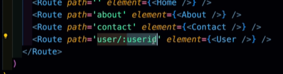

#### use useId using useParams

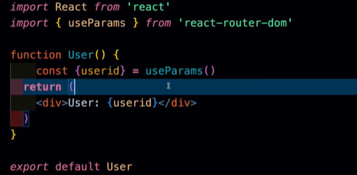


### Github API fetching

- Data send by in string format so first change into JSON format.

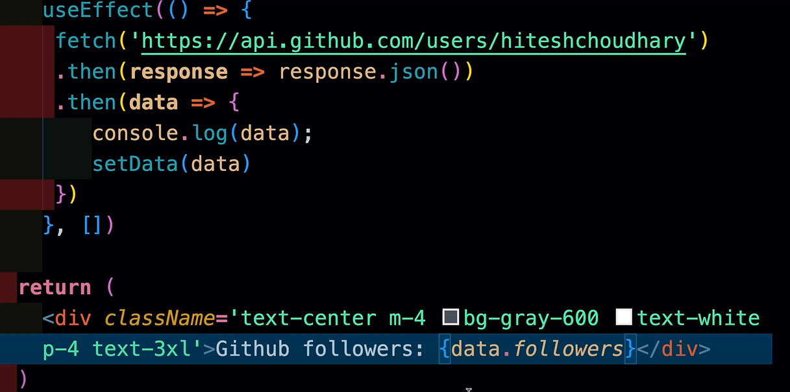

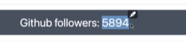

### react outlet
- it keep same header and footer 
- <Outlet/> portion keep change by required route componenet

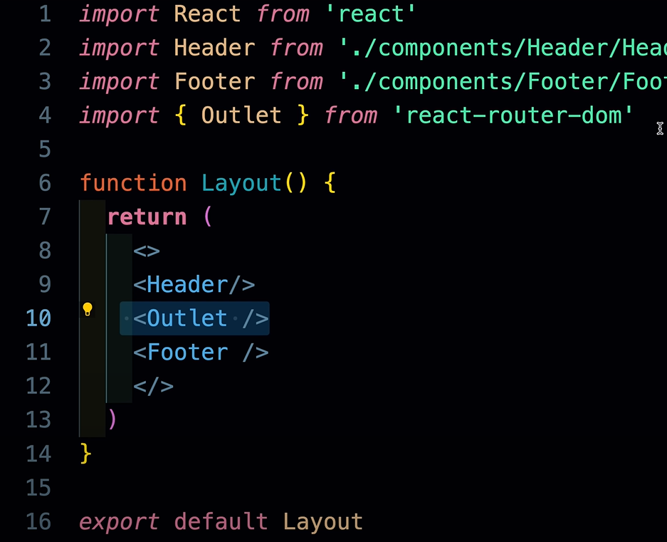

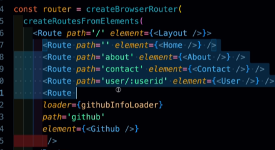


### Concept of Loader

```javascript

import React, { useEffect, useState } from 'react'
import { useLoaderData } from 'react-router-dom'

function Github() {
    const data = useLoaderData()
    // const [data, setData] = useState([])
    // useEffect(() => {
    //  fetch('https://api.github.com/users/hiteshchoudhary')
    //  .then(response => response.json())
    //  .then(data => {
    //     console.log(data);
    //     setData(data)
    //  })
    // }, [])
    
  return (
    <div className='text-center m-4 bg-gray-600 text-white p-4 text-3xl'>Github followers: {data.followers}
    
    </div>
  )
}

export default Github

export const githubInfoLoader = async () => {
    const response = await fetch('https://api.github.com/users/hiteshchoudhary')
    return response.json()
}

```


```javascript

import Github, { githubInfoLoader } from './components/Github/Github.jsx'


const router = createBrowserRouter(
  createRoutesFromElements(
    <Route path='/' element={<Layout />}>
      ....
      <Route 
      loader={githubInfoLoader}
      path='github' 
      element={<Github />}
       />
    </Route>
  )
)

```
---

## Context API

- Wrapping with userContext

  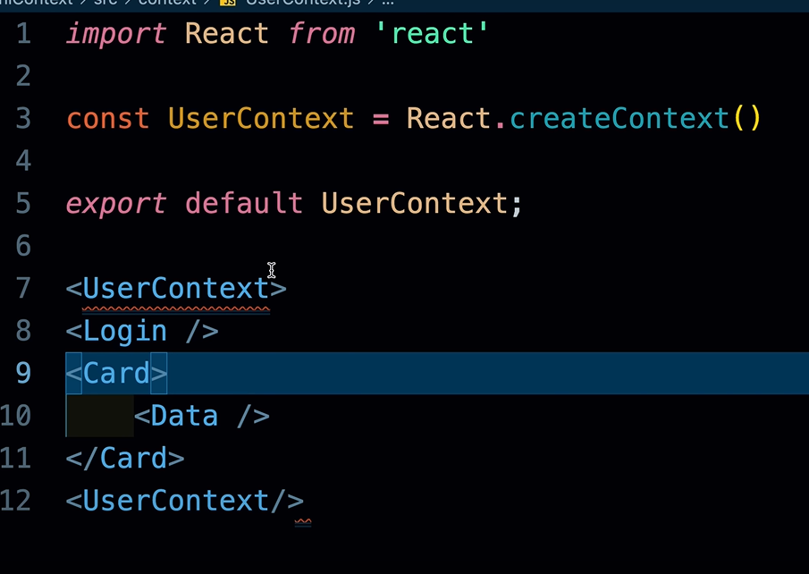

- syntax of userContext.Provider

  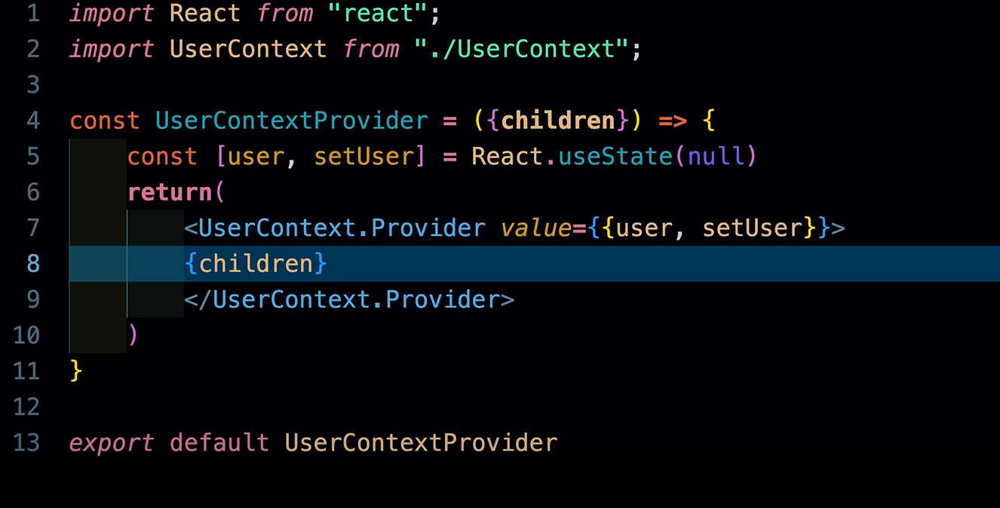

- Give access in <App/>
   
  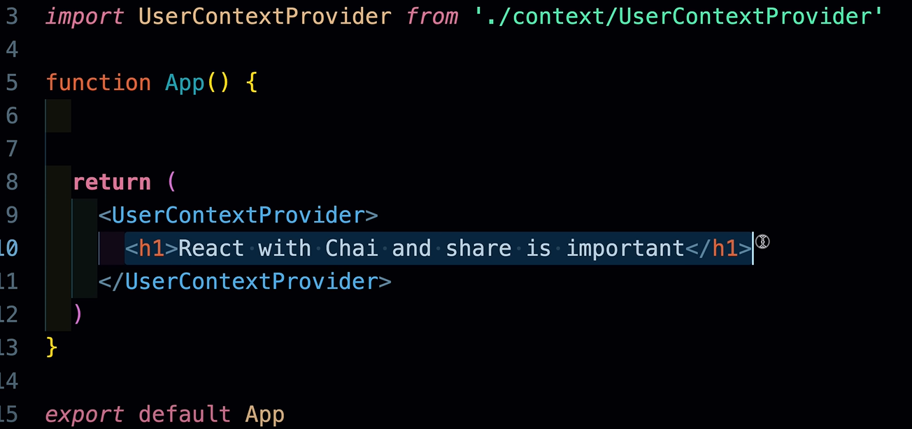

- How to use UserContext
  
  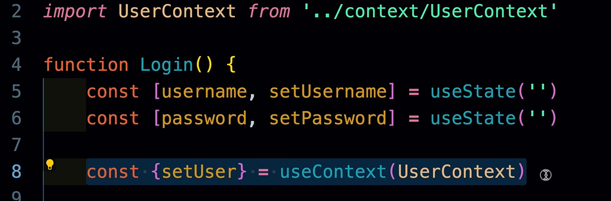

### Type -2 making context api

- Making of provider

```javascript
import { createContext, useContext } from "react";

export const ThemeContext = createContext({
    themeMode: "light",
    darkTheme: () => {},
    lightTheme: () => {},
})

export const ThemeProvider = ThemeContext.Provider

export default function useTheme(){
    return useContext(ThemeContext)
}
```


- Wrapping with provider

```javascript
    
import { useEffect, useState } from 'react'
import './App.css'
import { ThemeProvider } from './contexts/theme'
import ThemeBtn from './components/ThemeBtn'
import Card from './components/Card'

function App() {
  const [themeMode, setThemeMode] = useState("light")

  const lightTheme = () => {
    setThemeMode("light")
  }

  const darkTheme = () => {
    setThemeMode("dark")
  }

  // actual change in theme

  useEffect(() => {
    document.querySelector('html').classList.remove("light", "dark")
    document.querySelector('html').classList.add(themeMode)
  }, [themeMode])
  

  return (
    <ThemeProvider value={{themeMode, lightTheme, darkTheme}}>
      <div className="flex flex-wrap min-h-screen items-center">
          <div className="w-full">
              <div className="w-full max-w-sm mx-auto flex justify-end mb-4">
                  <ThemeBtn />
              </div>

              <div className="w-full max-w-sm mx-auto">
                  <Card />
              </div>
          </div>
      </div>
    </ThemeProvider>
  )
}

export default App

```


- Using of Context API    

```javascript

import React from 'react'
import useTheme from '../contexts/theme';

export default function ThemeBtn() {
    
    const {themeMode, lightTheme, darkTheme} = useTheme()
    const onChangeBtn = (e) => {
        const darkModeStatus = e.currentTarget.checked
        if (darkModeStatus) {
            darkTheme()
        } else {
            lightTheme()
        }
    }
    return (
        <label className="relative inline-flex items-center cursor-pointer">
            <input
                type="checkbox"
                value=""
                className="sr-only peer"
                onChange={onChangeBtn}
                checked={themeMode=== "dark"}
            />
            <div className="w-11 h-6 bg-gray-200 peer-focus:outline-none peer-focus:ring-4 peer-focus:ring-blue-300 dark:peer-focus:ring-blue-800 rounded-full peer dark:bg-gray-700 peer-checked:after:translate-x-full peer-checked:after:border-white after:content-[''] after:absolute after:top-[2px] after:left-[2px] after:bg-white after:border-gray-300 after:border after:rounded-full after:h-5 after:w-5 after:transition-all dark:border-gray-600 peer-checked:bg-blue-600"></div>
            <span className="ml-3 text-sm font-medium text-gray-900">Toggle Theme</span>
        </label>
    );
}

```

---

## Todo List Application

This React application manages a todo list with features to add, update, delete, and toggle the completion status of todos. The todos are persisted in `localStorage`.

### Features

- **Add Todo**: Add a new todo item to the list.
- **Update Todo**: Update an existing todo item.
- **Delete Todo**: Remove a todo item from the list.
- **Toggle Complete**: Mark a todo item as completed or not completed.
- **Persistence**: Todos are saved in `localStorage` and loaded on application start.

### Code Explanation

#### Adding a Todo

The `addTodo` function creates a new todo item with a unique `id` and merges it with the existing todos.
- here `addTodo()` get todo in this version 
```json
  {
    todo: "Home work",
    completed : false,
  }

```
- So' first we spread it and add  `id: Date.now()`, using date as unique id, and stored it with existing todos.


```javascript
const addTodo = (todo) => {
  setTodos((prev) => [{ id: Date.now(), ...todo }, ...prev]);
};
```

#### Updating a Todo

The `updateTodo` function updates an existing todo by matching the `id` and replacing the old todo with the new one.

```javascript
const updateTodo = (id, todo) => {
  setTodos((prev) => prev.map((prevTodo) => (prevTodo.id === id ? todo : prevTodo)));
};
```

#### Deleting a Todo

The `deleteTodo` function removes a todo from the list by filtering out the todo with the matching `id`.
- Delete using re-evaluate whole todos array.
- Using filter method we iterate over all todos and if any todo id match with given id,So`  we simply  not include into our array. 


```javascript
const deleteTodo = (id) => {
  setTodos((prev) => prev.filter((todo) => todo.id !== id));
};
```

#### Toggling Todo Completion

The `toggleComplete` function toggles the completion status of a todo item by matching the `id`.
- When we find a particular id object we simply spread it using "..." and chnage the completed only.
- Here our one object look like:

   Ex: 
```json

   todo = [
    { id : 1,
      todo : "Work from home",
      completed : false,
     },
    {},
    ...
   ]; 

```

```javascript
const toggleComplete = (id) => {
  setTodos((prev) => 
    prev.map((prevTodo) => 
      prevTodo.id === id ? { ...prevTodo, completed: !prevTodo.completed } : prevTodo));
};
```

#### Loading Todos from Local Storage

The following `useEffect` hook loads the todos from `localStorage` when the component mounts.
- we know Local storage keep safe value in form of string.
- So, first we access the value using "todos" key, and parse into JSON format.

```javascript
useEffect(() => {
  const todos = JSON.parse(localStorage.getItem("todos"));

  if (todos && todos.length > 0) {
    setTodos(todos);
  }
}, []);
```

#### Saving Todos to Local Storage

This `useEffect` hook saves the todos to `localStorage` whenever the `todos` state changes.
- Local storage keep safe items in form of string so, first we have to convert JSON data into string format to save int local storage.
- Local storage keep safe the data in form key value pari.
- You can access value using key e.g.: "todos" is a key.

```javascript
useEffect(() => {
  localStorage.setItem("todos", JSON.stringify(todos));
}, [todos]);
```
---

